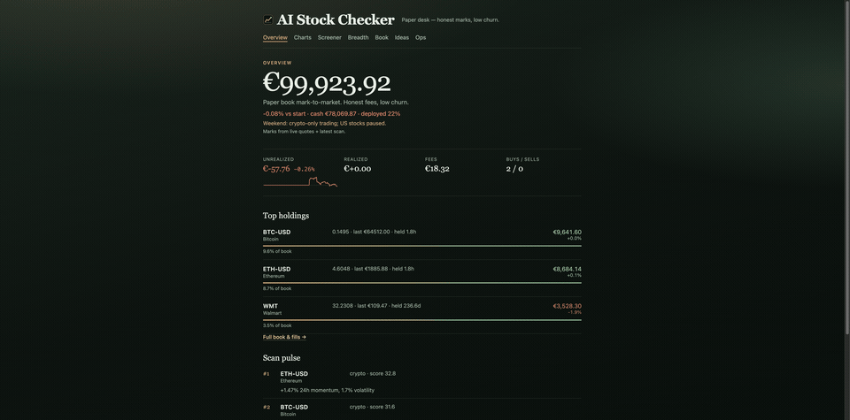
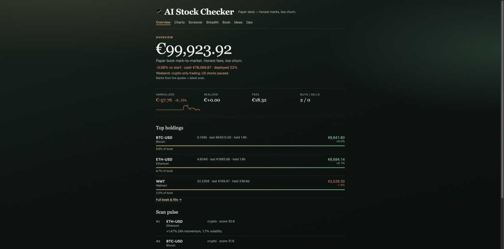
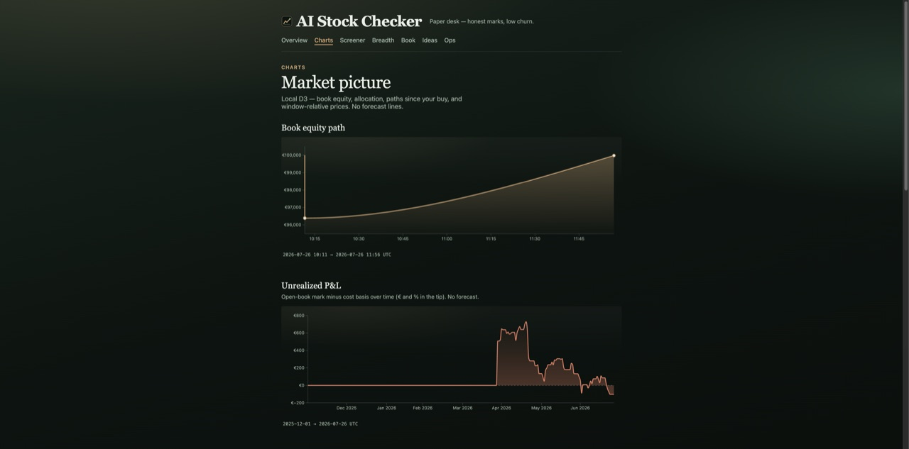
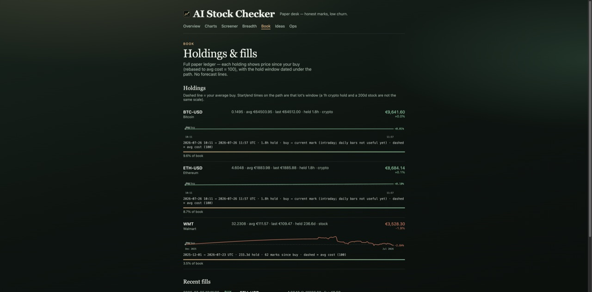
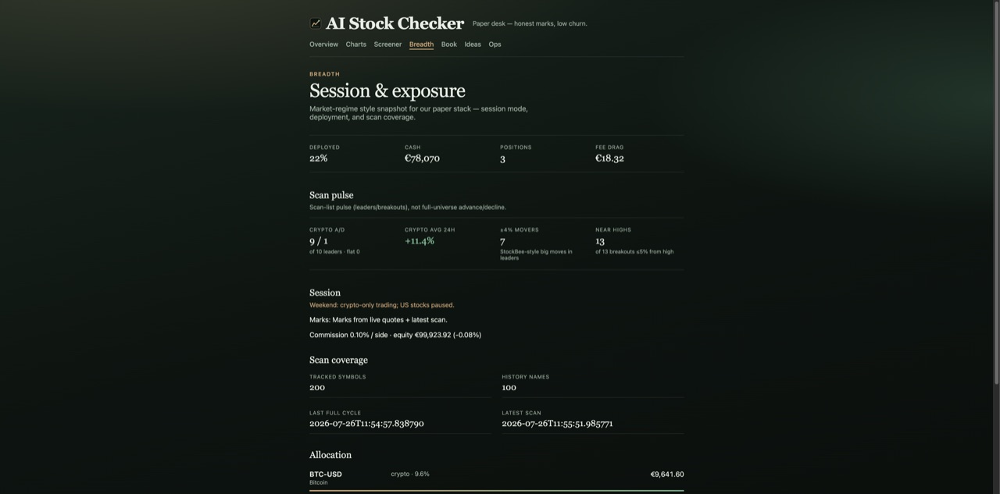

# AI Stock Checker

**A local paper-trading desk that refuses to lie to you.**

Docker-first stock & crypto scanning with anti-churn defaults, fee-aware paper fills, optional Ollama AI, and a quiet editorial UI — built for friends who want honest marks, not dashboard theater.

[](LICENSE)
[](https://www.python.org/)
[](docker-compose.yml)
[](https://github.com/raro42/ai-stock-checker/releases)

<p align="center">
  
</p>

<p align="center"><em>Seven screens · one chrome · Overview → Charts → Screener → Breadth → Book → Ideas → Ops</em></p>

---

## Why this exists

Most “AI trading” repos ship vibes: purple glow, fake Sharpe, hourly churn that dies to fees.

This one is the opposite:

- **Fees are real** — paper default matches **Revolut Standard–Metal** (0.25%/side · €1 min); Ops can switch Ultra (0.12%) or spot-like 0.1%
- **Forecasts are banned** until walk-forward beats SPY — charts show *what happened*, not fortune-telling
- **Paper desk first** — browse the book in your browser before you ever trust a loop
- **Docker-only runtime** — no “works on my laptop” dependency soup

If that sounds boring: good. Boring compounds.

---

## The desk

Seven screens. One chrome. Local D3 — no CDN roulette.

| Screen | Job |
|--------|-----|
| **Overview** | Equity, unrealized %, top holdings |
| **Charts** | Book path, allocation, since-buy, relative prices |
| **Screener** | Ranked paper candidates from the latest scan |
| **Breadth** | Session exposure + scan pulse (A/D on leaders) |
| **Book** | Holdings with dated paths since your buy |
| **Ideas** | Scanner picks + open research watch |
| **Ops** | Runtime knobs, gates, watchdog honesty |

Open locally after compose: **[http://127.0.0.1:7779/desk](http://127.0.0.1:7779/desk)**

<details>
<summary>Still frames</summary>

<p align="center">
  
  
</p>
<p align="center">
  
  
</p>

</details>

Design brief: [`DESIGN.md`](DESIGN.md) — editorial trading room, not AI-SaaS defaults.

---

## Quick start

**Need:** Docker. Optional: [Finnhub](https://finnhub.io) free key. Optional LLM: [Ollama](https://ollama.com) **or** free/cheap cloud (Groq / OpenRouter) — [MODELS.md](MODELS.md). No LLM required.

```bash
git clone https://github.com/raro42/ai-stock-checker.git
cd ai-stock-checker
cp .env.example .env   # AI_MODE=off by default; add cloud keys only if you want AI gates

docker compose up -d --build intelligent-trader openbb-backend
```

Then open the desk:

```text
http://127.0.0.1:7779/desk
```

Paper state lives in `./data/` (gitignored). Friends’ short path: [`FRIENDS.md`](FRIENDS.md).

### Defaults (anti-churn)

| | |
|--|--|
| Capital | €100,000 paper |
| Scan / trade | 15m / 5m |
| Min hold | **24h** (Ops; floor still ≥4h — we are not day-trading for sport) |
| Max positions | **5** (Ops; less book = less fee theater) |
| Regime / RS gates | **on** by default — toggle on Ops if you enjoy buying weakness |
| AI mode | `off` by default (rules-only). Set `AI_MODE=validate` + Ollama or cloud — see [MODELS.md](MODELS.md) |

---

## How we (try to) trade

No secret sauce. No “proprietary neural alpha.” Just a few rude filters between a scan list and a paper buy — because fees are real and FOMO is free.

**The vibe:** buy strength in healthy markets, hold long enough that Revolut doesn’t eat the thesis, don’t rotate losers to chase shiny new names. AI is optional seasoning, not the chef.

| Gate | What it actually does |
|------|------------------------|
| **Junk filter** | Stables, leveraged carnival tickets, and known noise stay in the lobby (`symbol_filters.py`) |
| **Earnings blackout** | No new stock entries when Finnhub says the calendar is about to punch you |
| **SMA regime** | Soft block new buys when SPY is below SMA200 or BTC below SMA50 — “buy the dip” can wait until the dip stops dipping |
| **Relative strength** | Soft block names lagging SPY (stocks) or BTC (crypto) over ~63 sessions — leaders over laggards; missing data fails *open*, not frozen |
| **Anti flip-flop** | Min hold + rebuy cooldown + “don’t sell losers just to rotate” — SCHW → SCHW twelve minutes later is not a strategy, it’s a tip jar |
| **Book posture** | Overweight → TP/SL only (no buys, no scan rotation). Slim books heal; fat books diet |

Yes, some of this smells like Minervini / Stage-2 hygiene we borrowed from open screeners ([GitHub watch](GITHUB_WATCH.md)). We stole the **discipline**, not their backtest screenshots. Ours still has to survive Revolut-shaped paper fees and a walk-forward promote gate before anyone gets to brag.

Ops checkboxes for regime + RS if you want to turn “boring” back into “interesting.” Interesting is usually expensive.

---

## What’s inside

- **Intelligent trader** — scan → rank → paper trade with persistence
- **Entry gates** — regime + relative strength + earnings + junk filters (see above)
- **OpenBB widgets** — same `:7779` backend for Pro workspace ([OPENBB.md](OPENBB.md))
- **Autoresearch** — overnight strategy search with walk-forward promote gate
- **GitHub research watch** — adapt one transferable pattern at a time ([GITHUB_WATCH.md](GITHUB_WATCH.md))
- **CLI** — `info`, `history`, `bitcoin`, `movers`, `backtest`

```bash
docker build -t ai-stock-checker .
docker run --rm --network host ai-stock-checker python3 -m stock_checker.cli info AAPL --analyze
docker run --rm ai-stock-checker pytest -q
```

---

## Honesty policy

We do **not** claim live edge without walk-forward evidence vs SPY.

Promote rule: experiment strategies must beat SPY on the **live-shaped** walk-forward blend (Revolut-standard fees + book caps) before enabling the Ops promote filter. Full-sample hero curves alone are not enough. Compose default-on waits for a calm paper month.

If a README ever reads like a hedge-fund pitch deck, open an issue and yell.

---

## Releases

We cut tagged releases when the desk or trader meaningfully changes — screenshots refreshed, notes honest.

- Latest: [Releases](https://github.com/raro42/ai-stock-checker/releases)
- How we cut them: [`RELEASES.md`](RELEASES.md)
- Refresh screenshots: `./scripts/capture_desk_screenshots.sh` (desk must be running)

---

## Docs map

| Doc | |
|-----|--|
| [USAGE.md](USAGE.md) | CLI flags |
| [PAPER_TRADING.md](PAPER_TRADING.md) | Paper loop deep dive |
| [AUTOPILOT.md](AUTOPILOT.md) | Continuous improvement |
| [IMPROVEMENT.md](IMPROVEMENT.md) | Backlog |
| [MODELS.md](MODELS.md) | Ollama **or** cheap cloud LLMs (Groq / OpenRouter / DeepSeek) |
| [GIT.md](GIT.md) | Commit / push ASAP |

---

## Star if you believe this

If you want another repo that promises “10× returns with GPT,” keep scrolling.

If you want a **local, fee-aware, paper-honest** desk you can actually run with friends — star it, fork it, open a PR with one small improvement.

<p align="center">
  <a href="https://github.com/raro42/ai-stock-checker/stargazers">⭐ Star on GitHub</a>
  ·
  <a href="https://github.com/raro42/ai-stock-checker/issues">Issues</a>
  ·
  <a href="FRIENDS.md">Run with friends</a>
</p>

---

## License

[MIT](LICENSE) © 2026 Ralf Roeber

Started Oct 2025 · paper through late 2025 · revived & hardened Jul 2026.
